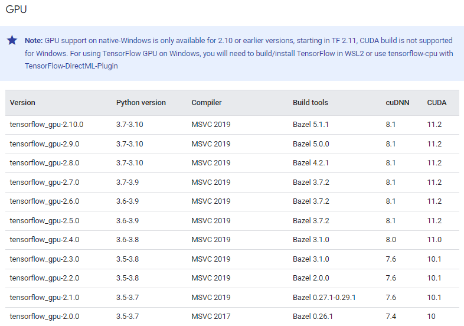

# Real-Time-Object-Detection-using-Tensorflow2-with-Nvidia-CUDA-GPU
## Introduction
This guide provides a streamlined process for setting up TensorFlow 2 with GPU acceleration using NVIDIA CUDA and cuDNN on Windows 10 or 11. It covers the installation of the CUDA Toolkit and cuDNN library, environment variable configuration, and Anaconda environment setup to optimize TensorFlow 2 for real-time object detection tasks.

## Anaconda Installation 
1. Operating System : Windows 10 or windows 11
2. Anaconda https://repo.anaconda.com/archive/
   Install Anaconda and Microsoft Visual C++ Redistributable
Go to window search, click the “Environment Variables…” button to open the “Environment Variables” window.
Under “System variables”, search for and click on the Path system variable, then click “Edit…”
Add the following paths, then click “OK” to save the changes:
   ```
   C:\Users\USER-NAME\anaconda3\python.exe
   C:\Users\USER-NAME\anaconda3\Scripts
   C:\Users\USER-NAME\anaconda3\libs\python34
   C:\Users\USER-NAME\anaconda3\Library\bin
   C:\Users\USER-NAME\anaconda3\
   ```
## CUDA and CuDNN Installation
Cuda and CuDNN GPU-compatibility Chart:


1.CUDA installed 
Follow this link to download and install CUDA Toolkit 11.2
https://developer.nvidia.com/cuda-toolkit-archive

2.CuDNN installed
Select Download cuDNN v8.1.0 (January 26th, 2021), for CUDA 11.0,11.1 and 11.2
https://developer.nvidia.com/rdp/cudnn-archive

3.Extract the contents of the zip file (i.e. the folder named cuda) inside <INSTALL_PATH>\NVIDIA GPU Computing Toolkit\CUDA\v11.2\, where <INSTALL_PATH> points to the installation directory specified during the installation of the CUDA Toolkit. By default <INSTALL_PATH> = C:\Program Files.

4.Go to Start and Search “environment variables”

Click “Edit the system environment variables”. This should open the “System Properties” window

In the opened window, click the “Environment Variables…” button to open the “Environment Variables” window.

Under “System variables”, search for and click on the Path system variable, then click “Edit…”

Add the following paths, then click “OK” to save the changes:
```
C:\Program Files\NVIDIA GPU Computing Toolkit\CUDA\v11.2\bin

C:\Program Files\NVIDIA GPU Computing Toolkit\CUDA\v11.2\libnvvp

C:\Program Files\NVIDIA GPU Computing Toolkit\CUDA\v11.2\include

C:\Program Files\NVIDIA GPU Computing Toolkit\CUDA\v11.2\extras\CUPTI\lib64

C:\Program Files\NVIDIA GPU Computing Toolkit\CUDA\v11.2\cuda\bin
```
## Tensorflow 2 Installation

### Step 1. create a new environment in Conda
python Verison 3.7 - 3.10
```
conda create -n tf2 python=3.9 anaconda
```
```
activate tf2
```
```
python -m pip install --upgrade pip
```
### Step 2. Install TF Model Garden

```
cd /
```
```
mkdir tf2
```
```
cd tf2
```
```
git clone https://github.com/tensorflow/models
```
### Step 3. Install Tensorflow

tensorflow==2.10.1

```
pip install --ignore-installed --upgrade tensorflow==2.10.1

```

Tensorflow-gpu
```
pip install --ignore-installed --upgrade tensorflow-gpu

```
Verify the installation
```
python -c "import tensorflow as tf;print(tf.reduce_sum(tf.random.normal([1000, 1000])))"
```
### Step 4. Package install
```
conda install -c anaconda protobuf
pip install Cython
pip install opencv-python
pip install contextlib2
pip install jupyter
pip install matplotlib
pip install pandas
```
```
pip install "git+https://github.com/philferriere/cocoapi.git#egg=pycocotools&subdirectory=PythonAPI"
```
### Step 5. Protobuf Installation/Compilation
```
cd C:\tensorflow1\models\research
```
https://github.com/protocolbuffers/protobuf/releases

protoc object_detection/protos/*.proto --python_out=.
```
protoc --python_out=. .\object_detection\protos\anchor_generator.proto .\object_detection\protos\argmax_matcher.proto .\object_detection\protos\bipartite_matcher.proto .\object_detection\protos\box_coder.proto .\object_detection\protos\box_predictor.proto .\object_detection\protos\eval.proto .\object_detection\protos\faster_rcnn.proto .\object_detection\protos\faster_rcnn_box_coder.proto .\object_detection\protos\grid_anchor_generator.proto .\object_detection\protos\hyperparams.proto .\object_detection\protos\image_resizer.proto .\object_detection\protos\input_reader.proto .\object_detection\protos\losses.proto .\object_detection\protos\matcher.proto .\object_detection\protos\mean_stddev_box_coder.proto .\object_detection\protos\model.proto .\object_detection\protos\optimizer.proto .\object_detection\protos\pipeline.proto .\object_detection\protos\post_processing.proto .\object_detection\protos\preprocessor.proto .\object_detection\protos\region_similarity_calculator.proto .\object_detection\protos\square_box_coder.proto .\object_detection\protos\ssd.proto .\object_detection\protos\ssd_anchor_generator.proto .\object_detection\protos\string_int_label_map.proto .\object_detection\protos\train.proto .\object_detection\protos\keypoint_box_coder.proto .\object_detection\protos\multiscale_anchor_generator.proto .\object_detection\protos\graph_rewriter.proto .\object_detection\protos\calibration.proto .\object_detection\protos\flexible_grid_anchor_generator.proto
```
```
C:\Program Files\NVIDIA GPU Computing Toolkit\Protobuf\bin
```


### Step 6. setup installation.

```
copy object_detection\packages\tf2\setup.py C:\tf2\models\research

```

```
python -m pip install . 
```

```
python object_detection/builders/model_builder_tf2_test.py
```


### Step 7. Choose and Download the TF2 Model Zoo 
```
cd C:\tf\models\research\object_detection
```
Choose the tf2 models
https://github.com/tensorflow/models/blob/master/research/object_detection/g3doc/tf2_detection_zoo.md

### Edit the path in object_detection_camera.py

MODELS_DIR = 'data/models'
MODEL_NAME = 'C:/tf/models/research/object_detection/tf2/20200711/ssd_resnet101_v1_fpn_640x640_coco17_tpu-8'

### Step 8. Run the model code.
```
python object_detection_camera.py
```
